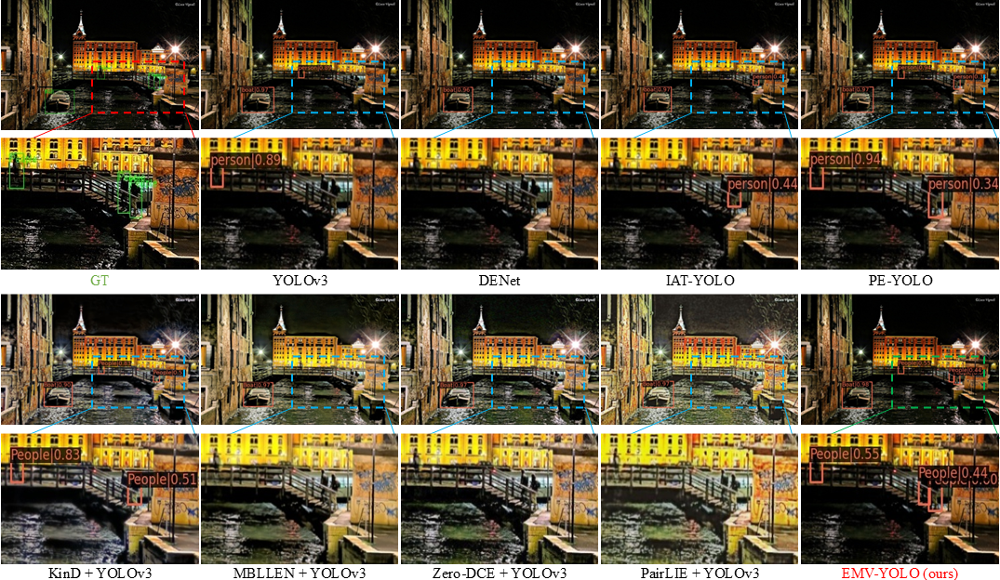

# [BMVC 2024] Toward Highly Efficient Semantic-Guided Machine Vision for Low-Light Object Detection
[Paper](https://bmva-archive.org.uk/bmvc/2024/papers/Paper_262/paper.pdf)    [Poster](https://bmva-archive.org.uk/bmvc/2024/papers/Paper_262/poster.pdf)

# Introduction


Detectors trained on well-lit data often experience significant performance degradation when applied to low-light conditions. To address this challenge, low-light enhancement methods are commonly employed to improve detection performance. However, existing human vision-oriented enhancement methods have shown limited effectiveness, which overlooks the semantic information for detection and achieves high computation costs. To overcome these limitations, we introduce a machine vision-oriented highly efficient low-light object detection method with the Efficient semantic-guided Machine Vision-oriented module (EMV). EMV can dynamically adapt to the object detection part based on end-to-end training and emphasize the semantic information for the detection. Besides, by lightening the network for feature decomposition and generating the enhanced image on latent space, EMV is a highly lightweight network for image enhancement, which contains only 27K parameters and achieves high inference speed. Extensive experiments conducted on ExDark and DarkFace datasets demonstrate that our method significantly improves detector performance in low-light environments.



# Getting Started

## Dataset

**Step 1: Dataset Download**

(1). Download **EXDark** (include images enhancement by MBLLEN, Zero-DCE, KIND, PairLIE) in VOC format from  [Baidu Netdisk](https://pan.baidu.com/s/1ssnGTl9-u4JHavUA1Gd2EQ?pwd=1234), passwd:1234.

(2). Then unzip:

```
unzip Exdark.zip
```

We have already split the EXDark dataset with train set (80%) and test set (20%).

The EXDark dataset format should be look like:

```
EXDark
│      
│
└───JPEGImages
│   │───IMGS (original low light)
│   │───IMGS_Kind (imgs enhancement by [Kind, mm 2019])
│   │───IMGS_ZeroDCE (imgs enhancement by [ZeroDCE, cvpr 2020])
│   │───IMGS_MBLLEN (imgs enhancement by [MBLLEN, bmvc 2018])
│   │───IMGS_PairLIE (imgs enhancement by [PairLIE, CVPR 2023])
│───Annotations   
│───main
│───label
```

(3). Then change [line2](https://github.com/Zeng555/EMV-YOLO/blob/main/configs/_base_/datasets/exdark_yolo.py#L2) (EMV-YOLO/configs\_base_/datasets/exdark_yolo.py) to your own data path.

## Dependencies

1. Create conda environment

   ```
   conda create -n EMV-YOLO python=3.8 -y
   conda activate EMV-YOLO
   ```

2. Install PyTorch. This repo is tested with PyTorch==1.10.0

   ​	for OSX:

   ```
   conda install pytorch==1.10.0 torchvision==0.11.0 torchaudio==0.10.0 -c pytorch
   ```

   ​	for Linux and Windows:

   ```
   # CUDA 10.2
   conda install pytorch==1.10.0 torchvision==0.11.0 torchaudio==0.10.0 cudatoolkit=10.2 -c pytorch
   
   # CUDA 11.3
   conda install pytorch==1.10.0 torchvision==0.11.0 torchaudio==0.10.0 cudatoolkit=11.3 -c pytorch -c conda-forge
   
   # CPU Only
   conda install pytorch==1.10.0 torchvision==0.11.0 torchaudio==0.10.0 cpuonly -c pytorch
   ```

   

3. Install python packages using following command:	

   (1) Download mmcv 1.4.0, and download adapte to your own cuda version and torch version:

   ```
   pip install mmcv-full==1.4.0 -f https://download.openmmlab.com/mmcv/dist/cu111/torch1.10.0/index.html
   ```

   (2) Then set up mmdet (2.15.1):

   ```
   pip install opencv-python scipy
   pip install -r requirements/build.txt
   pip install -v -e .
   ```

   ## Train

   **Training your own model**

   ```
   python tools/train.py configs/yolo/yolov3_EMV_Exdark.py
   ```

   ## Test

   **Test your own model**

   ```
   python tools/test.py configs/yolo/yolov3_EMV_Exdark.py $<YOUR PRE-TRAINED WEIGHTS PATH>$ --eval mAP
   ```

   

#### Reference

Detection task is use [mmdetection](https://mmdetection.readthedocs.io/en/latest/), some of the code are borrow from [IAT](https://github.com/cuiziteng/Illumination-Adaptive-Transformer), thanks so much!


If this code or paper help you, please cite us.

